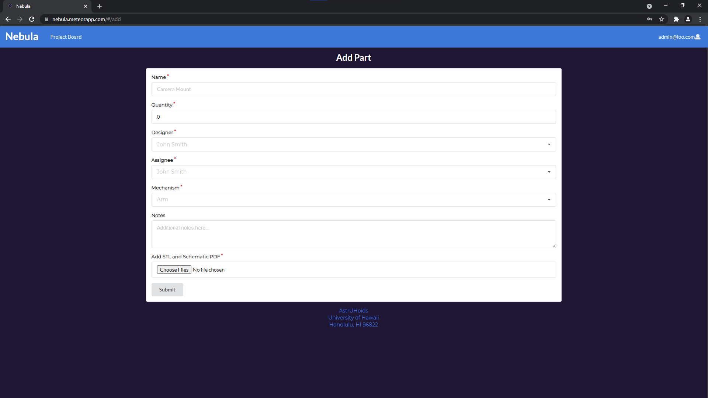

## What is Nebula?
Nebula is a project board developed for [Meteor Hackathon 2021](https://impact.meteor.com/hackathon) where
our group needed to develop an app that would have an impact on our community.

#### So why make a project board if you are have applications such as Trello?

The reason is that we wanted to develop a project board that was more dedicated to the workflow of teams for
[FIRST Robotics Competition (FRC)](https://www.firstinspires.org/robotics/frc) as we all have been previous competitors
of this organization. Our project board differs in that we have support for viewing `.stl` files, or 3D CAD
models. We want to use our application for our old team [2445 Robokap](http://www.kapoleirobotics.com/Welcome.html) to
make the managing of workflow easier for our advisor. Currently, they need to document each part in a spreadsheet, then
go and look for an email with the schematics, print everything out before being able to assign it to a student. Now, all
of this can be done in one central application, and also save on paper!

## Benefits
Our aim was to create a central hub where they can easily find their parts, download schematics, and view a 3D model
of what students will be fabricating.
### Benefits to students
Constantly moving to different parts of the workshop students may leave their schematic in a place and have trouble
finding it, or bringing it with them to the machine and spilling oil on it. The parts are also assigned through a schedule
that is created by the advisor, but is they were not there, then the student would have to look through a pile of paper
for the part they were assigned.

Our goal was to make it easy for students to view all parts, and filter it to show them what they need to specifically
work on. This is aimed to make it easy for students to track their own progress on assigned parts and always have a way
to hold a copy of the schematics.

### Benefits to advisors
Going through multiple applications and hundreds of emails to find a specific part's schematics can be time consuming.
There are times when emergencies come up and the advisor needs to reassign parts to a student. During that time, there
can be stress that can cause you to forget things such as marking down who is working on the part.

Our goal is to make this process a lot easier so that there will be less stress during this period. This project board
aims to make this process simpler for the advisor to have one application that has everything that is needed (i.e.,
schematics, part name, quantity, etc.).

Another goal is to make it simple to track the progress of the overall project. Instead of having to count how many parts
on a spreadsheet are completed, in-progress, and still need to be done, we wanted a easy progress bar to show this. It
can help with scheduling extra hours if more work needs to be completed in order to accommodate for times where there
is a large portion of parts left to be done with less days remaining till the competition.

## Managing Your Project With Nebula
Our application is currently just a simple interface that allows all those benefits come to life for both the advisor
and student. Views between the two may vary slightly, so we will notate advisor view only by adding an `*` (ex. edit*).

All members will first be greeted with the landing page:


If you do not already have an account, you need to sign up for one:


Once registered, members will be redirected to the project board:


Hovering over the cards, you can get to different parts such as view more information:


or edit*:


If advisors need to add a new part, they can click on the + icon on the 'To Do' column to see:


Finally, the members can move the parts into different columns by dragging and dropping:


## Installation
Download and install the latest version of [Meteor](https://www.meteor.com/)
Clone the repository to your local system and open the `app` directory in a terminal.
To run locally:
```
meteor npm install
meteor npm run start
```
Due to having access keys for our AWS S3 bucket, we have edited the `package.json` file to run locally with
`settings.production.json` to have it ignored when committing changes to Github. Please see
[.deploy/settings.sample.json](app/.deploy/settings.sample.json) for an example.

## Deployment
Nebula was deployed to [Galaxy](https://galaxy.meteor.com/). To deploy your own version, you should first login and see
```
$ meteor login
username: username
password: 

Logged in as username. Thanks for being a Meteor developer!
```
Once logged in, open the `app` directory in the terminal and run the following commands:
```
SET DEPLOY_HOSTNAME=us-east-1.galaxy-deploy.meteor.com
meteor deploy --settings ..\config\settings.production.json [site name].meteorapp.com --free
```
For this to work, make sure you have a `settings.production.json` file. See
[.deploy/settings.sample.json](app/.deploy/settings.sample.json) for an example.

## AstrUHoids Developers
- [Deshay Clemons](https://github.com/deshay-clemons)
- [Luke McDonald](https://github.com/lukemcd9)
- [Kevin Nguyen](https://github.com/kvndngyn)
- [Gabriel Undan](https://github.com/gabrielundan)
